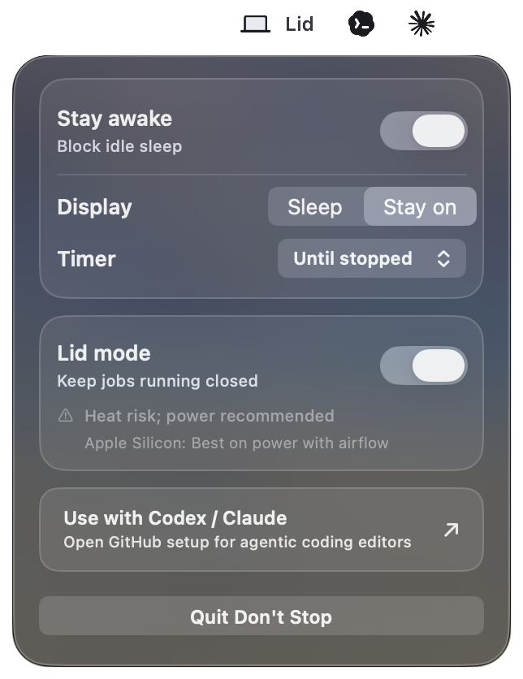
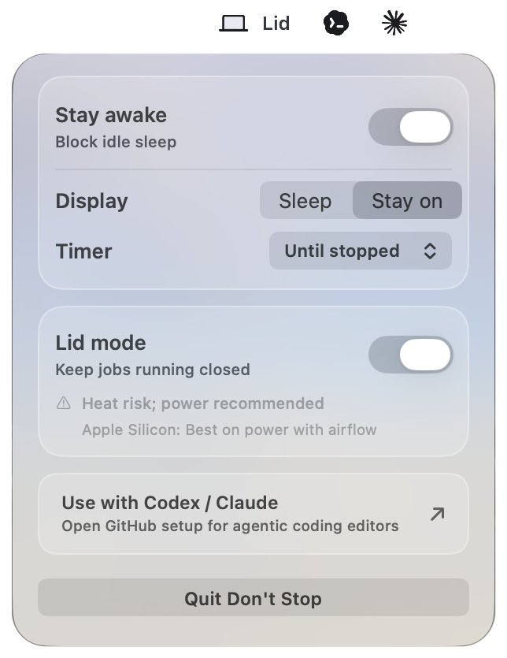

# Don't Stop

Don't Stop is a tiny macOS menu bar app that keeps the Mac awake using native `IOPMAssertion` power-management assertions.

<p align="center">
  
  
</p>

## Links

- Repository: <https://github.com/aannuuj/dont-stop>
- Commit history: <https://github.com/aannuuj/dont-stop/commits/master/>
- CLI reference: [docs/cli.md](docs/cli.md)
- Codex and Claude setup: [docs/agent-setup.md](docs/agent-setup.md)

## Build and Run

```sh
make test
make build
open "build/Don't Stop.app"
```

The menu bar item is a compact laptop icon with one status word: `Ready`, `Awake`, or `Lid`. Its tooltip and menu show whether the app is keeping the Mac awake.

The menu bar control panel shows a compact frosted settings window:

- Stay awake while open: prevents normal idle sleep while the MacBook is open
- Screen: let the display turn off, or keep it on
- Stop after: choose when awake mode turns off
- Run after lid closes: asks once for scoped permission, then switches lid mode without repeated prompts

Left-click the menu bar item to open the compact control panel. Right-click or Command-click it to open the settings menu.

## Shortcuts

macOS does not let a regular menu bar app add its own third-party tile directly into Control Center. The closest supported path is a Shortcuts action that opens one of Don't Stop's URL commands:

```text
dont-stop://toggle
dont-stop://on
dont-stop://off
dont-stop://settings
dont-stop://lid-toggle
dont-stop://lid-on
dont-stop://lid-off
dont-stop://display-toggle
dont-stop://display-on
dont-stop://display-off
```

In Shortcuts, create a shortcut with an `Open URLs` action and paste one of those URLs. Use a laptop icon and a short name like `Awake` or `Lid`.

## Agent Skill

The repo includes a portable `dont-stop` skill for Codex and Claude Code:

```sh
make install-skills
```

Codex can discover the repo skill from `.agents/skills/dont-stop`. Claude Code can discover the project alias from `.claude/skills/dont-stop`. The install target also copies the same skill to `~/.agents/skills/dont-stop` and `~/.claude/skills/dont-stop` for use outside this repo.

See [docs/agent-setup.md](docs/agent-setup.md) for the GitHub-friendly setup steps.

Use it in an agent prompt as `$dont-stop`, for example:

```text
Use $dont-stop to keep this long-running test command awake and clean it up afterward.
```

## Lid Close Behavior

Don't Stop blocks normal idle sleep while the MacBook is open. Lid mode goes further: it lets long-running jobs continue after the lid closes by changing a system-level power setting.

The first time you enable lid mode, macOS asks for admin permission and Don't Stop installs a narrowly scoped permission so future lid-mode switches do not ask again.

Keep the Mac on a hard surface with airflow, preferably on power, and turn lid mode off when the long-running job is done. On Apple Silicon, lid-close behavior is partly hardware-gated, so reliability is best on power and even better with an external display attached.

If the app crashes while lid mode is on, the next app launch detects Don't Stop's lid marker and tries to restore normal sleep behavior without prompting.

## Terminal Helper

The helper writes a command file to `~/Library/Application Support/DontStop/commands` and starts the app if needed.

Full command reference: [docs/cli.md](docs/cli.md).

```sh
./bin/dont-stop on --minutes 180 --reason codex
./bin/dont-stop off
./bin/dont-stop status
./bin/dont-stop lid status
```

For Codex or Claude sessions, wrap the command so Don't Stop turns on for the process and turns off when it exits:

```sh
./bin/dont-stop run -- codex
./bin/dont-stop run -- claude
```

To also keep the Mac running with the lid closed for the lifetime of a terminal session:

```sh
./bin/dont-stop run --lid -- codex
./bin/dont-stop run --lid -- claude
```

You can manage lid-closed running directly from Terminal:

```sh
./bin/dont-stop lid on
./bin/dont-stop lid off
./bin/dont-stop permission status
./bin/dont-stop permission reset
```

To keep the display awake too:

```sh
./bin/dont-stop on --reason demo --display
./bin/dont-stop run --display -- claude
```

## Optional Install

```sh
make install
make install-helper
```

`make install` copies the app to `~/Applications/Don't Stop.app`. `make install-helper` copies the terminal helper to `~/.local/bin/dont-stop`.

If the helper lives somewhere else, point it at the app:

```sh
DONT_STOP_APP="$HOME/Applications/Don't Stop.app" dont-stop on --reason codex
```

The app releases all assertions when you turn the mode off or quit the menu bar app.

## Release Build

```sh
make test
make release
make dmg
```

`make release` creates an ad-hoc signed app in `dist/Don't Stop.app`. `make dmg` packages it as `dist/Don't Stop-<version>.dmg`. The app is not notarized yet, so first launch may still require Gatekeeper approval.

For public distribution, use Developer ID signing and notarization. See [Release And Notarization](docs/notarization.md).
